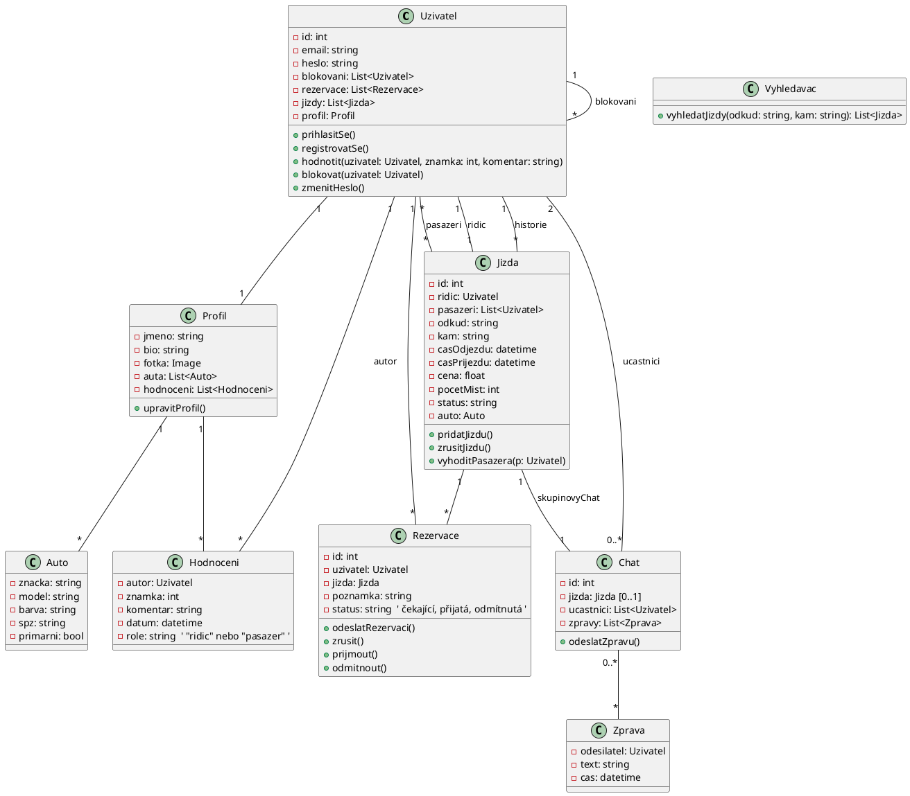

```plantuml
@startuml

' ===== Třídy =====

class Uzivatel {
    - id: int
    - email: string
    - heslo: string
    - blokovani: List<Uzivatel>
    - rezervace: List<Rezervace>
    - jizdy: List<Jizda>
    - profil: Profil
    + prihlasitSe()
    + registrovatSe()
    + hodnotit(uzivatel: Uzivatel, znamka: int, komentar: string)
    + blokovat(uzivatel: Uzivatel)
    + zmenitHeslo()
}

class Profil {
    - jmeno: string
    - bio: string
    - fotka: Image
    - auta: List<Auto>
    - hodnoceni: List<Hodnoceni>
    + upravitProfil()
}

class Hodnoceni {
    - autor: Uzivatel
    - znamka: int
    - komentar: string
    - datum: datetime
    - role: string  ' "ridic" nebo "pasazer" '
}

class Auto {
    - znacka: string
    - model: string
    - barva: string
    - spz: string
    - primarni: bool
}

class Jizda {
    - id: int
    - ridic: Uzivatel
    - pasazeri: List<Uzivatel>
    - odkud: string
    - kam: string
    - casOdjezdu: datetime
    - casPrijezdu: datetime
    - cena: float
    - pocetMist: int
    - status: string
    - auto: Auto
    + pridatJizdu()
    + zrusitJizdu()
    + vyhoditPasazera(p: Uzivatel)
}

class Rezervace {
    - id: int
    - uzivatel: Uzivatel
    - jizda: Jizda
    - poznamka: string
    - status: string  ' čekající, přijatá, odmítnutá '
    + odeslatRezervaci()
    + zrusit()
    + prijmout()
    + odmitnout()
}

class Chat {
    - id: int
    - jizda: Jizda [0..1]
    - ucastnici: List<Uzivatel>
    - zpravy: List<Zprava>
    + odeslatZpravu()
}

class Zprava {
    - odesilatel: Uzivatel
    - text: string
    - cas: datetime
}

class Vyhledavac {
    + vyhledatJizdy(odkud: string, kam: string): List<Jizda>
}

' ===== Vztahy =====

Uzivatel "1" -- "1" Profil
Profil "1" -- "*" Auto
Profil "1" -- "*" Hodnoceni
Hodnoceni "*" -- "1" Uzivatel : autor

Uzivatel "1" -- "*" Rezervace
Uzivatel "1" -- "*" Jizda : historie
Uzivatel "1" -- "*" Uzivatel : blokovani

Jizda "*" -- "*" Uzivatel : pasazeri
Jizda "1" -- "*" Rezervace
Jizda "1" -- "1" Uzivatel : ridic

Chat "0..*" -- "*" Zprava
Chat "0..*" -- "2" Uzivatel : ucastnici
Jizda "1" -- "1" Chat : skupinovyChat

@enduml
```