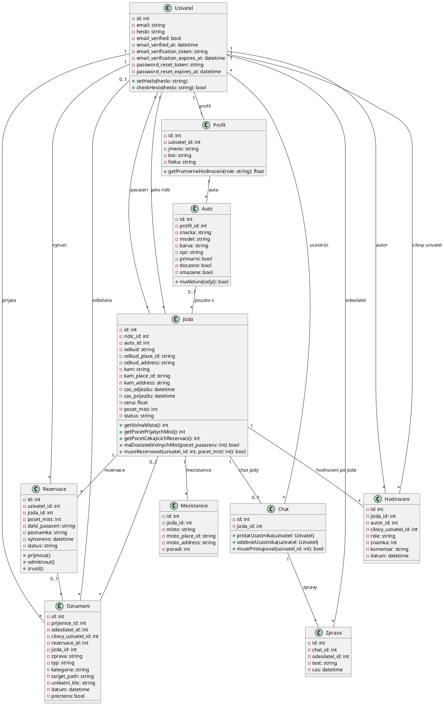

```plantuml
@startuml

' Zjednoduseny diagram trid podle aktualniho backendu.
' Blokovani je zamerne vynechano.

class Uzivatel {
    - id: int
    - email: string
    - heslo: string
    - email_verified: bool
    - email_verified_at: datetime
    - email_verification_token: string
    - email_verification_expires_at: datetime
    - password_reset_token: string
    - password_reset_expires_at: datetime
    + setHeslo(heslo: string)
    + checkHeslo(heslo: string): bool
}

class Profil {
    - id: int
    - uzivatel_id: int
    - jmeno: string
    - bio: string
    - fotka: string
    + getPrumerneHodnoceni(role: string): float
}

class Auto {
    - id: int
    - profil_id: int
    - znacka: string
    - model: string
    - barva: string
    - spz: string
    - primarni: bool
    - docasne: bool
    - smazane: bool
    + maAktivniJizdy(): bool
}

class Jizda {
    - id: int
    - ridic_id: int
    - auto_id: int
    - odkud: string
    - odkud_place_id: string
    - odkud_address: string
    - kam: string
    - kam_place_id: string
    - kam_address: string
    - cas_odjezdu: datetime
    - cas_prijezdu: datetime
    - cena: float
    - pocet_mist: int
    - status: string
    + getVolnaMista(): int
    + getPocetPrijatychMist(): int
    + getPocetCekajicichRezervaci(): int
    + maDostatekVolnychMist(pocet_pasazeru: int): bool
    + muzeRezervovat(uzivatel_id: int, pocet_mist: int): bool
}

class Mezistanice {
    - id: int
    - jizda_id: int
    - misto: string
    - misto_place_id: string
    - misto_address: string
    - poradi: int
}

class Rezervace {
    - id: int
    - uzivatel_id: int
    - jizda_id: int
    - pocet_mist: int
    - dalsi_pasazeri: string
    - poznamka: string
    - vytvoreno: datetime
    - status: string
    + prijmout()
    + odmitnout()
    + zrusit()
}

class Chat {
    - id: int
    - jizda_id: int
    + pridatUcastnika(uzivatel: Uzivatel)
    + odebratUcastnika(uzivatel: Uzivatel)
    + muzePristupovat(uzivatel_id: int): bool
}

class Zprava {
    - id: int
    - chat_id: int
    - odesilatel_id: int
    - text: string
    - cas: datetime
}

class Hodnoceni {
    - id: int
    - jizda_id: int
    - autor_id: int
    - cilovy_uzivatel_id: int
    - role: string
    - znamka: int
    - komentar: string
    - datum: datetime
}

class Oznameni {
    - id: int
    - prijemce_id: int
    - odesilatel_id: int
    - cilovy_uzivatel_id: int
    - rezervace_id: int
    - jizda_id: int
    - zprava: string
    - typ: string
    - kategorie: string
    - target_path: string
    - unikatni_klic: string
    - datum: datetime
    - precteno: bool
}

Uzivatel "1" -- "1" Profil : profil
Profil "1" -- "*" Auto : auta

Uzivatel "1" -- "*" Jizda : jako ridic
Jizda "*" -- "*" Uzivatel : pasazeri
Jizda "1" -- "*" Rezervace : rezervace
Jizda "1" -- "*" Mezistanice : mezistanice
Auto "0..1" -- "*" Jizda : pouzito v

Uzivatel "1" -- "*" Rezervace : vytvari

Jizda "1" -- "0..1" Chat : chat jizdy
Chat "*" -- "*" Uzivatel : ucastnici
Chat "1" -- "*" Zprava : zpravy
Uzivatel "1" -- "*" Zprava : odesilatel

Uzivatel "1" -- "*" Hodnoceni : autor
Uzivatel "1" -- "*" Hodnoceni : cilovy uzivatel
Jizda "1" -- "*" Hodnoceni : hodnoceni po jizde

Uzivatel "1" -- "*" Oznameni : prijata
Uzivatel "0..1" -- "*" Oznameni : odeslana
Jizda "0..1" -- "*" Oznameni
Rezervace "0..1" -- "*" Oznameni

@enduml
```
