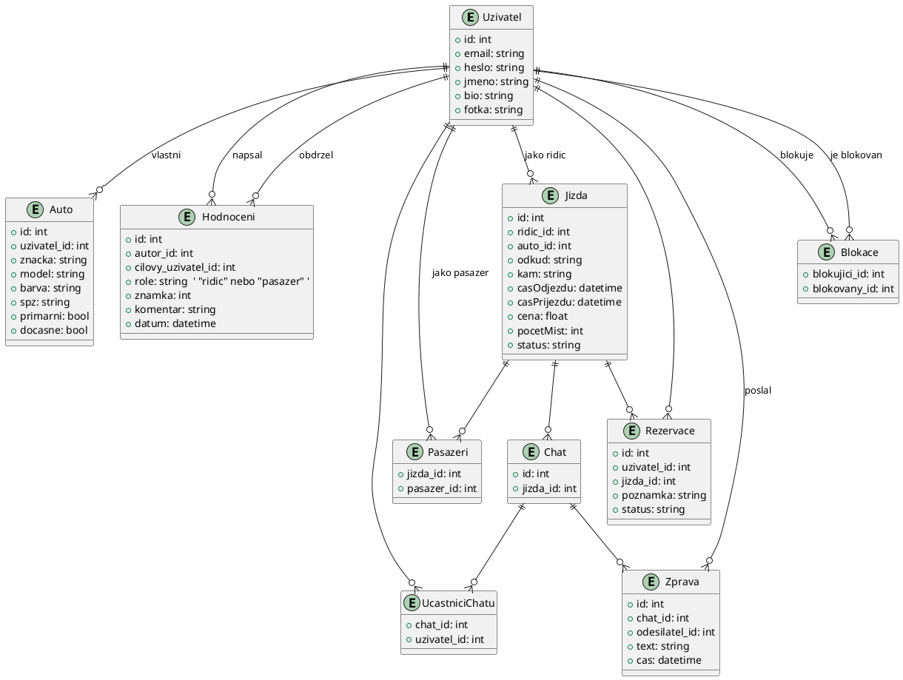

```plantuml

@startuml

entity Uzivatel {
    +id: int
    +email: string
    +heslo: string
    +jmeno: string
    +bio: string
    +fotka: string
}

entity Auto {
    +id: int
    +uzivatel_id: int
    +znacka: string
    +model: string
    +barva: string
    +spz: string
    +primarni: bool
    +docasne: bool
}

entity Hodnoceni {
    +id: int
    +autor_id: int
    +cilovy_uzivatel_id: int
    +role: string  ' "ridic" nebo "pasazer" '
    +znamka: int
    +komentar: string
    +datum: datetime
}

entity Jizda {
    +id: int
    +ridic_id: int
    +auto_id: int
    +odkud: string
    +kam: string
    +casOdjezdu: datetime
    +casPrijezdu: datetime
    +cena: float
    +pocetMist: int
    +status: string
}

entity Pasazeri {
    +jizda_id: int
    +pasazer_id: int
}

entity Rezervace {
    +id: int
    +uzivatel_id: int
    +jizda_id: int
    +poznamka: string
    +status: string
}

entity Chat {
    +id: int
    +jizda_id: int
}

entity UcastniciChatu {
    +chat_id: int
    +uzivatel_id: int
}

entity Zprava {
    +id: int
    +chat_id: int
    +odesilatel_id: int
    +text: string
    +cas: datetime
}

entity Blokace {
    +blokujici_id: int
    +blokovany_id: int
}

Uzivatel ||--o{ Auto : vlastni
Uzivatel ||--o{ Hodnoceni : napsal
Uzivatel ||--o{ Hodnoceni : obdrzel
Uzivatel ||--o{ Rezervace
Uzivatel ||--o{ Jizda : jako ridic
Uzivatel ||--o{ Pasazeri : jako pasazer
Uzivatel ||--o{ Zprava : poslal
Uzivatel ||--o{ UcastniciChatu

Jizda ||--o{ Rezervace
Jizda ||--o{ Pasazeri
Jizda ||--o{ Chat

Chat ||--o{ Zprava
Chat ||--o{ UcastniciChatu

Uzivatel ||--o{ Blokace : blokuje
Uzivatel ||--o{ Blokace : je blokovan

@enduml

```